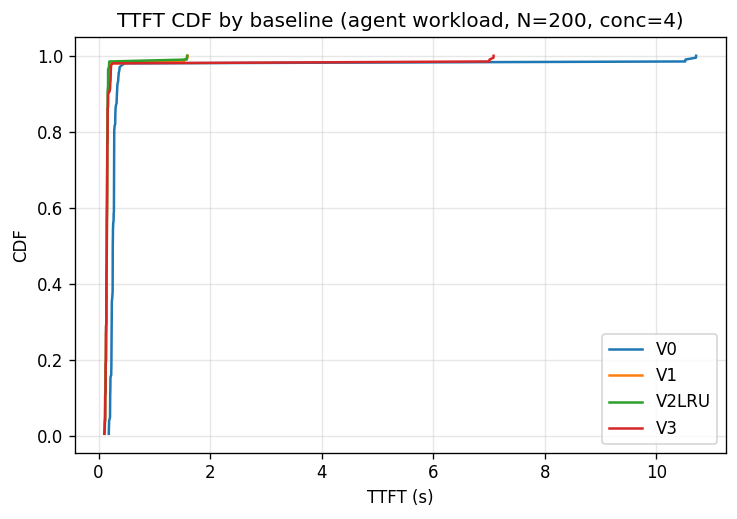
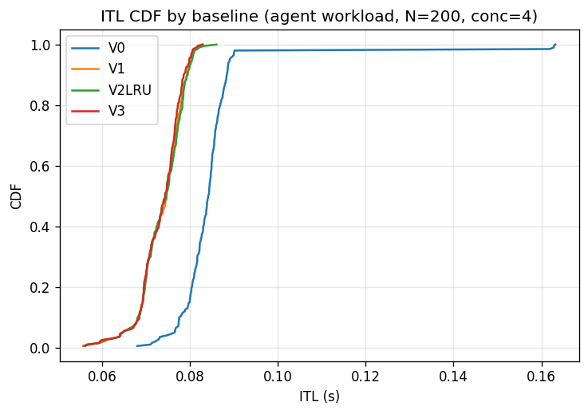
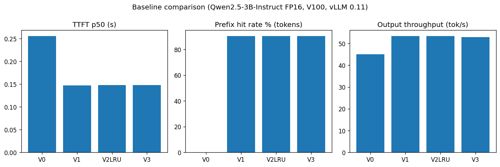
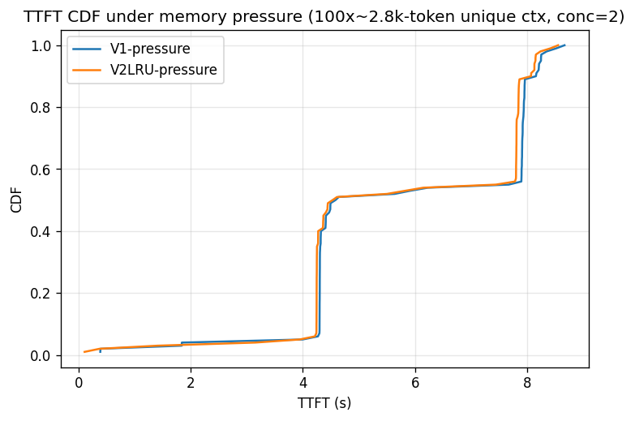
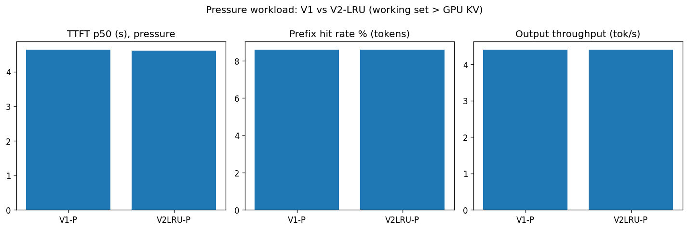

# 实验报告：实验2 Benchmark 2（Agent Workflow）+ vLLM

> 分工来源：`tasks/我的任务A0.md` “实验2: Benchmark 2 + vLLM”
> 实验人任务范围：仅本实验，其余实验由他人负责
> 运行日期：2026-09-09；运行环境：远端 Ubuntu 22.04 + 2×Tesla V100-32GB（实验后已清理，见§8）

## 1. 实验目标

复现并 profile **agent类工作负载**下 vLLM 的 KV Cache 管理行为，对比
GPU前缀复用与CPU offload tier对TTFT、ITL、吞吐的影响，为后续优化
（Benchmark 3 / 自研eviction policy）找切入点。

## 2. 环境与总体配置

| 项目 | 设置 |
|---|---|
| OS / Kernel | Ubuntu 22.04.1, kernel 5.15 |
| GPU | 2× Tesla V100-SXM2-32GB（SM70），驱动535.129，CUDA driver 12.2；实验只用卡0 |
| CPU / 内存 | 10× Xeon Gold 6248，117GB RAM |
| 推理框架 | vLLM **0.11.0** + transformers 4.55.4（`VLLM_ENABLE_CUDA_COMPATIBILITY=1`，`--enforce-eager`） |
| 模型 | Qwen/Qwen2.5-3B-Instruct，FP16（权重约5.8GiB） |
| GPU KV pool | `--gpu-memory-utilization 0.5` → 约8.6GiB |
| CPU KV pool | 8GiB |
| max_model_len | 4096 |

### 与任务书的偏差（均有实测依据）

| 项目 | 任务书 | 实际 | 原因 |
|---|---|---|---|
| 模型 | 3B-GPTQ-Int4 | 3B-Instruct **FP16** | V100无Marlin核，GPTQ只能走legacy慢速路径；FP16KV行为一致且6GB一次装下 |
| KV dtype | bf16 | **fp16** | V100无bf16硬件，bf16直接无法启动 |
| vLLM版本 | 未定 | 0.11.0 | 0.8.5无原生offload；0.11是最后一个带sm70可用核的版本（更新版已删sm70） |
| workload | BFCL v4直接跑 | agent合成负载（见§4） | BFCL是精度榜；本实验要serving侧TTFT/ITL/命中率。结构对标BFCL multi-turn：共享system+tools前缀＋用户轮次 |

## 3. Baseline矩阵

| ID | Cache机制 | Eviction | GPU tier | CPU tier | 启动关键参数 |
|---|---|---|---|---|---|
| V0 | None | — | ✓ | × | `--no-enable-prefix-caching`（注：0.11默认prefix cache是开的，必须显式关） |
| V1 | Prefix Cache | GPU默认 | ✓ | × | `--enable-prefix-caching` |
| V2-LRU | Native KV Offloading | LRU | ✓ | 8GiB | `--kv-transfer-config '{"kv_connector":"OffloadingConnector","kv_role":"kv_both","kv_connector_extra_config":{"num_cpu_blocks":14000,"block_size":16}}'`（0.11.0 schema） |
| V2-ARC | — | ARC | — | — | **BLOCKED**：vLLM 0.11与LMCache 0.5.4均无ARC实现；有ARC的新版vLLM无sm70核 |
| V3 | LMCache | LRU | ✓ | 8GiB | `LMCacheConnectorV1` + `LMCACHE_LOCAL_CPU=True, LMCACHE_MAX_LOCAL_CPU_SIZE=8` |

## 4. Workload说明

- **常规workload**：200请求，并发4。共享system前缀（角色+3个tool定义+trace格式，约350 token）＋10种tool任务模板×20组参数；`max_tokens=128`，`temperature=0`，streaming计时。
- **压力workload**：100请求，并发2。每请求在system后追加一份**unique约2.4k token参考文档**（单请求约2.8k token），工作集约20GB > 8.6GB GPU池，强制驱逐；`max_tokens=64`。
- Warmup：每轮4请求先行，不计入统计（另：TTFT p99多为首请求冷启动，见§5注）。

## 5. 指标记录与结果

计时方法：OpenAI兼容接口SSE首token时间=TTFT；`/metrics`实验前后差值取命中/查询数。

### 5.1 常规workload

| Baseline | TTFT p50 / p95 / p99 (s) | ITL p50 (s) | E2E p50 (s) | req/s | out tok/s | prefix命中率 |
|---|---|---|---|---|---|---|
| V0 | 0.256 / 0.362 / 10.71 | 0.084 | 10.52 | 0.39 | 45.1 | 0% |
| V1 | **0.147** / 0.198 / 1.60 | **0.075** | 9.09 | **0.46** | **53.4** | **90.4%** |
| V2-LRU | 0.148 / 0.171 / 1.58 | 0.075 | 9.07 | 0.46 | 53.4 | 90.4% |
| V3 | 0.148 / 0.219 / 7.08 | 0.074 | 9.11 | 0.45 | 52.9 | 90.4% |

结论：prefix cache使TTFT p50下降**43%**（0.256→0.147s），吞吐+18%；工作集可完全装入GPU时，V1/V2-LRU/V3三者一致（命中数精确到token相同），CPU tier无事可做，符合预期。

### 5.2 压力workload

| Baseline | TTFT p50 / p95 (s) | ITL p50 (s) | E2E p50 (s) | req/s | 命中率 |
|---|---|---|---|---|---|
| V1-P | 4.64 / 8.25 | 0.345 | 29.46 | 0.069 | 8.6% |
| V2LRU-P | 4.61 / 8.15 | 0.344 | 29.33 | 0.069 | 8.6% |

结论（阴性结果，如实记录）：两者**完全一致**（命中数精确到个位相同：23760/276390）。
根因：unique文档每份只用一次、跨请求零复用——被驱逐的块永远不会被再次请求，offload无从发挥。
给后续的输入：**offload的价值 ∝ 被驱逐内容的复用率**；Benchmark 3应构造“超GPU的多轮复用会话”（如重复访问的长RAG语料、agent多episode回看），才能拉开V1与V2的差距。
注：第一版V1P曾与被kill的短prompt任务混跑同一server导致命中率虚高46%，已废弃；上表为干净重跑版V1P2。

### 5.3 补充观察

- `request_queue_time`总量可忽略（约0.01s/req）：瓶颈在计算（prefill/decode）而非排队。
- 压力下`request_prefill_time`均值约5.5s/req：TTFT主要由长上下文prefill计算构成。

## 6. 缺口声明（未做事项）

| 任务书要求 | 状态 | 原因 / 补跑成本 |
|---|---|---|
| QPS-TTFT/ITL曲线 | 未做（固定并发4/2） | 需重装远端环境，每个QPS点约0.5–1h |
| I/O时间线甘特图 | 未做 | 同上，需请求级preill/decode/loading打点 |
| BFCL精度分 | 未跑 | 本次只测serving侧；精度需另接`bfcl generate` |
| offload字节/带宽定量 | 无telemetry | vLLM 0.11.0的`/metrics`无`kv_offload_*`counter；需升级vLLM（要Ampere+卡）或给connector加instrumentation |
| V2-ARC | BLOCKED | 见§3 |

## 7. 原始数据

`bench_V*.json`（per-req TTFT/ITL/E2E＋metrics前后快照）、`bench_*pressure.json`、
`fig_*.png`、`smoke_v0.json`，与本报告同目录。计时=streaming SSE，命中率=Δhits/Δqueries。

## 8. 环境清理

远端已删：`~/a0-work`、`~/a0-venv`、`~/a0-venv2`、`~/.cache/uv`、`/tmp/pip-*`残留、
tmux会话、全部vLLM/bench进程；验证双卡0MiB、无残留进程、他人tmux未动。
遗留：`~/.cache/pip`涨约2.8GB（共享缓存，可`pip cache purge`）。
